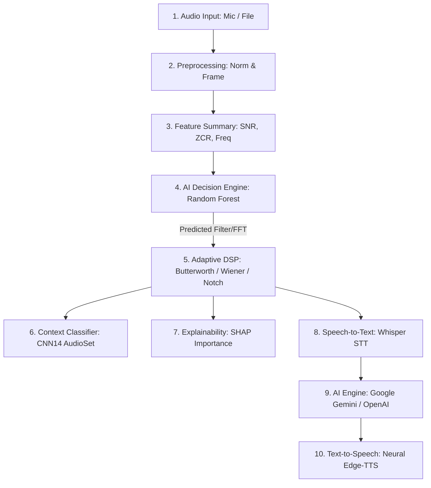

# 🤖 Voice Assistant

A real-time Python voice chatbot with DSP visualization.  
**Microphone → Whisper STT → LLM → TTS → Speakers**

---

## ✨ Features

| Feature | Details |
|---|---|
| 🎙️ Microphone Input | Press-to-talk via `Enter` key |
| 🗣️ Speech-to-Text | Faster-Whisper (OpenAI Whisper optimized) |
| 🤖 AI Response | OpenAI GPT-4o or Google Gemini |
| 🔊 Text-to-Speech | Microsoft Edge neural TTS or pyttsx3 offline |
| 📊 DSP Visualization | Waveform, FFT spectrum, energy meter, stats |
| 💬 Conversation Memory | Keeps N turns of history for context |
| 🔔 Wake Word | Optional "Hello Assistant" trigger |
| 🔇 Noise Estimation | Background noise floor calibration |


---

## 🔄 AI-Adaptive DSP & Voice Assistant Pipeline

The assistant processes audio signals through a custom 8-stage intelligent pipeline, adjusting acoustic filters before querying the language model:



### Detailed Pipeline Stages
1. **Audio Input**: Live browser microphone recording (`MediaRecorder`) or uploaded `.wav`/`.mp3` files.
2. **Preprocessing**: Normalizes peak amplitude, centers offset (DC removal), and splits signals into overlapping windows.
3. **Feature Summary**: Computes Signal-to-Noise Ratio (SNR), background noise floor, zero-crossing rate, dominant frequencies, spectral centroid, and bandwidth.
4. **AI Decision Engine**: A Random Forest model trained on noise profiles (or hardcoded rules for silences/hum) selects the optimal filter and FFT size.
5. **Adaptive DSP**: Dynamically applies Butterworth (lowpass, highpass, bandpass), Notch (electrical hum suppression), or Wiener filters.
6. **Context Classification**: Classifies background sounds (like Speech, Animals, or Crowds) using a pretrained CNN14 model.
7. **Explainability (SHAP)**: Back-propagates feature contributions to explain why a specific filter or parameter set was selected.
8. **Speech-to-Text**: Feeds clean, noise-filtered audio into Faster-Whisper to generate an accurate text transcription.
9. **AI Language Model**: Queries Gemini or GPT with the user's request and conversation context.
10. **Text-to-Speech**: Generates response voice using neural synthesized speech (`edge-tts`).

---

## 📁 Project Structure

```
voice_assistant/
│
├── main.py          ← Entry point — run this file
├── audio_utils.py   ← Microphone recording, WAV save/load, noise estimation
├── dsp_utils.py     ← FFT, waveform plots, real-time visualizer
├── ai_utils.py      ← OpenAI / Gemini API, conversation history, wake word
├── tts_utils.py     ← edge-tts (neural) and pyttsx3 (offline) TTS
├── requirements.txt ← Python dependencies
└── README.md        ← This file
```

**Auto-created folders at runtime:**
```
recordings/          ← Saved WAV files (one per turn)
plots/               ← DSP dashboard images (PNG per turn)
temp_audio/          ← Temporary TTS audio files (auto-deleted)
```

---

## ⚙️ Installation

### 1. Prerequisites

- **Python 3.8+** — [Download](https://python.org/downloads)
- **ffmpeg** — Required for MP3 audio playback via pydub

```powershell
# Install ffmpeg on Windows (using winget)
winget install Gyan.FFmpeg

# Verify installation
ffmpeg -version
```

> On macOS: `brew install ffmpeg`  
> On Linux: `sudo apt install ffmpeg`

---

### 2. Create Virtual Environment

```powershell
# Navigate to the project folder
cd voice_assistant

# Create virtual environment
python -m venv venv

# Activate it (Windows PowerShell)
venv\Scripts\Activate.ps1

# Activate it (Windows CMD)
venv\Scripts\activate.bat

# Activate it (macOS/Linux)
source venv/bin/activate
```

---

### 3. Install Dependencies

```powershell
pip install -r requirements.txt
```

> First run of `faster-whisper` will download the Whisper model  
> (~150MB for `base`, ~1.5GB for `large`).

---

### 4. Set API Keys

You need at least **one** AI backend key.

#### Option A — OpenAI (GPT-4o)
```powershell
# Windows PowerShell
$env:OPENAI_API_KEY = "sk-..."

# macOS/Linux
export OPENAI_API_KEY="sk-..."
```
Get a key at: https://platform.openai.com/api-keys

#### Option B — Google Gemini (free tier available)
```powershell
# Windows PowerShell
$env:GEMINI_API_KEY = "AIza..."

# macOS/Linux
export GEMINI_API_KEY="AIza..."
```
Get a free key at: https://aistudio.google.com/app/apikey

#### Option C — Using a `.env` File (RECOMMENDED)
Instead of setting environment variables manually in your shell for every session, you can use a `.env` file in the root of the `voice_assistant` directory to manage your keys and tokens.

1. Copy the provided template to create your `.env` file:
   ```powershell
   # Windows PowerShell
   copy .env.example .env

   # macOS / Linux
   cp .env.example .env
   ```
2. Open the `.env` file and insert your API keys and Hugging Face Hub token:
   ```env
   OPENAI_API_KEY=your_openai_api_key_here
   GEMINI_API_KEY=your_gemini_api_key_here
   HF_TOKEN=your_hf_token_here
   ```

> [!TIP]
> Setting a `HF_TOKEN` (Hugging Face User Access Token) is highly recommended. It authenticates requests when downloading Whisper model weights, enabling higher rate limits, faster download speeds, and suppressing unauthenticated Hub warnings.

---

## 🚀 Running the Application

### Basic Usage

```powershell
# Use default settings (OpenAI backend, edge-tts, base Whisper)
python main.py

# Use Gemini instead of OpenAI
python main.py --backend gemini

# Use offline TTS (no internet needed for voice output)
python main.py --tts-engine pyttsx3

# Use a more accurate Whisper model (slower)
python main.py --whisper-model small

# Disable plots (faster, no GUI needed)
python main.py --no-plots
```

### All Command-Line Options

```
python main.py --help

options:
  --backend, -b       AI backend: openai | gemini  (default: openai)
  --temperature, -t   AI creativity: 0.0–1.0       (default: 0.7)
  --max-tokens        Max AI response tokens        (default: 300)
  --max-history       Conversation turns to keep    (default: 10)

  --whisper-model, -w tiny|base|small|medium|large  (default: base)
  --language, -l      Language code: en, es, fr...  (default: en)
  --beam-size         Transcription beam width       (default: 5)
  --no-vad            Disable voice activity filter
  --device            cpu | cuda                     (default: cpu)
  --compute-type      int8 | float16 | float32       (default: int8)

  --sample-rate, -r   Microphone Hz                 (default: 44100)
  --calibrate         Run noise calibration at startup

  --tts-engine        edge_tts | pyttsx3            (default: edge_tts)
  --tts-voice         Edge TTS voice name           (default: en-US-JennyNeural)
  --no-plots          Disable DSP visualization
```

---

## 🎮 How to Use

```
╔══════════════════════════════════════════╗
║   🤖 Voice Assistant  v1.0.0            ║
║                                          ║
║   Press Enter  → Start recording        ║
║   Press Enter  → Stop  recording        ║
║   "quit"       → Exit                   ║
║   "clear history" → Reset memory        ║
║   Ctrl+C       → Force quit             ║
╚══════════════════════════════════════════╝
```

**Step-by-step per turn:**
1. Press **Enter** → recording begins
2. Speak naturally
3. Press **Enter** again → recording stops
4. DSP dashboard pops up (waveform + FFT)
5. Whisper transcribes your speech
6. Your words are shown in the terminal
7. AI generates a response
8. Response is displayed in terminal
9. Response is spoken through your speakers
10. Repeat!

---

## 📊 DSP Visualization Explained

After each recording, a **4-panel dashboard** appears:

| Panel | What It Shows |
|---|---|
| **Waveform** | Audio amplitude over time. Speech looks like a burst of waves. |
| **FFT Spectrum** | Which frequencies are present. Red line = dominant frequency. Green band = speech range (300–3400 Hz). |
| **Energy Meter** | How loud the audio was. Green=quiet, Yellow=moderate, Red=loud. |
| **Statistics** | Duration, sample rate, RMS energy, dB level, dominant frequency, FFT resolution. |

### Key DSP Concepts

**FFT (Fast Fourier Transform)**  
Converts the waveform (amplitude vs time) into a spectrum (amplitude vs frequency).  
Formula: `X[k] = Σ x[n] * e^(-j2πkn/N)`  
We use `numpy.fft.fft()` and keep only the positive half (0 to Nyquist frequency).

**RMS Energy**  
`RMS = sqrt( mean( sample² ) )`  
Represents perceived loudness. Ranges from 0.0 (silence) to 1.0 (maximum).

**Dominant Frequency**  
The frequency with the highest FFT magnitude in the 50–4000 Hz range.  
For human voice: typically 85–255 Hz (fundamental pitch).

**Nyquist Theorem**  
Maximum representable frequency = sample_rate / 2.  
At 44100 Hz sample rate: max freq = 22050 Hz (beyond human hearing).

---

## 🔔 Special Voice Commands

| Say | Effect |
|---|---|
| `"quit"` / `"exit"` / `"goodbye"` | Shuts down the assistant |
| `"clear history"` / `"start over"` | Resets conversation memory |
| `"show history"` | Prints conversation log to terminal |
| `"Hello Assistant"` | Activates assistant (if wake word mode is ON) |

---

## 🌐 ESP32 Expansion Guide

The architecture is designed so you can swap the microphone/speaker layer with an **ESP32 over WiFi** without changing the AI or DSP logic.

### Current Architecture
```
[Laptop Mic] → record_audio() → [numpy array] → transcribe → AI → TTS → [Laptop Speakers]
```

### ESP32 Architecture
```
[ESP32 Mic] → HTTP POST WAV → Flask server → transcribe → AI → TTS → HTTP response → [ESP32 Speaker]
```

### What to Change

**In `main.py`**, replace `record_with_enter_to_stop()` with:

```python
from flask import Flask, request
import io

app = Flask(__name__)

@app.route("/upload_audio", methods=["POST"])
def receive_audio_from_esp32():
    """Receive WAV audio from ESP32 via HTTP POST."""
    wav_bytes = request.data          # Raw WAV bytes from ESP32
    audio_data, sr = load_wav_from_bytes(wav_bytes)
    
    # Run the same pipeline: transcribe → AI → TTS
    text = transcribe_audio(wav_path)
    response = query_ai(text, history)
    
    # Return TTS audio as MP3 bytes for ESP32 to play
    tts_bytes = generate_tts_bytes(response)
    return tts_bytes, 200, {"Content-Type": "audio/mpeg"}
```

**On the ESP32 (MicroPython / Arduino):**
```python
# Record audio from I2S microphone
# POST it to the laptop server
import urequests
audio = record_i2s()
r = urequests.post("http://192.168.1.100:5000/upload_audio", data=audio)
play_audio(r.content)   # Play the TTS response
```

**All DSP, Whisper, AI, and TTS code stays exactly the same!**

---

## 🔧 Troubleshooting

### "No audio captured" / PortAudio error
```powershell
# List available microphones
python -c "import sounddevice; print(sounddevice.query_devices())"

# Use a specific microphone by index
python main.py  # Then check the [Audio] device list printed at startup
```

### Whisper transcription is wrong or empty
- Speak louder and closer to the microphone
- Try `--no-vad` to disable Voice Activity Detection
- Try a larger model: `--whisper-model small`
- Check that your WAV file was saved in `recordings/`

### edge-tts not playing / silent output
```powershell
# Check ffmpeg is installed
ffmpeg -version

# Fall back to pyttsx3 (no ffmpeg needed)
python main.py --tts-engine pyttsx3
```

### OpenAI API error: "Invalid API key"
```powershell
# Verify the key is set
echo $env:OPENAI_API_KEY

# Set it again if needed
$env:OPENAI_API_KEY = "sk-your-key-here"
```

### matplotlib window not appearing
```powershell
# Install tkinter support (Windows)
# Reinstall Python and check "tcl/tk and IDLE" checkbox

# Or disable plots and use terminal only
python main.py --no-plots
```

### "ModuleNotFoundError" for any package
```powershell
# Make sure virtual environment is activated
venv\Scripts\Activate.ps1

# Reinstall all dependencies
pip install -r requirements.txt --force-reinstall
```

---

## 📦 Library Quick Reference

| Library | Purpose | Key Function Used |
|---|---|---|
| `sounddevice` | Microphone I/O | `sd.InputStream()`, `sd.play()` |
| `numpy` | Array math + FFT | `np.fft.fft()`, `np.sqrt()`, `np.mean()` |
| `scipy` | WAV file I/O | `wavfile.write()`, `wavfile.read()` |
| `faster-whisper` | Speech recognition | `WhisperModel.transcribe()` |
| `openai` | GPT API | `client.chat.completions.create()` |
| `google-generativeai` | Gemini API | `GenerativeModel.start_chat()` |
| `edge-tts` | Neural TTS | `Communicate.save()` |
| `pyttsx3` | Offline TTS | `engine.say()`, `engine.runAndWait()` |
| `pydub` | MP3 → PCM | `AudioSegment.from_file()` |
| `matplotlib` | Plotting | `plt.subplots()`, `FuncAnimation()` |

---

## 📄 License

MIT License — free to use, modify, and distribute.

---

*Built with Python 3.8+ | Faster-Whisper | OpenAI / Gemini | edge-tts | matplotlib*
